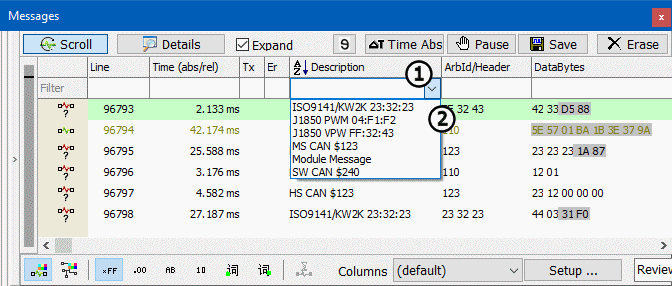

# Part 6 - More Ways to Filter in Vehicle Spy

Besides setting up custom filters, there are other ways to filter in Vehicle Spy. Column filters provide a fast and efficient way to sort through hundreds of messages without setting up a custom filter.

### 1. Filter Columns using pull down list:

Put Vehicle Spy online in "Simulation Mode" if it is not already online. Column sorting and filtering can be changed while online or offline, but the changes are only applied if Vehicle Spy is online. Just below the actual heading in each column is an empty space reserved for column filters. Double click in the blank space below the **Description** heading, exposing a drop down menu of all message descriptions from the Messages view (Figure 1: ).Select one of the listed descriptions and press **Enter**. Now the message description fills the space under the column heading and only messages with that description are shown. This filtering technique applies to the other columns such as ArbId/Header as well.

### 2. Column Filters Using the Entry Field:

Imagine working with hundreds of messages, and the specific message being looked for has an arbitration ID with a 6 in it. However, the full number has been forgotten. Simply type 6 in the blank field beneath the **ArbId/Header** column heading and hit **Enter**. Only messages with an arbitration ID including a 6 are visible such as 640, 126, and 260.\
\
Now, imagine that the desired arbitration ID ends in a 3. Simply enter in "??3" and Vehicle Spy shows you all arbitration IDs ending with the number 3 such as 123, 333, 643, etc. To include more than one message in a filter, separate them using a comma like "?2?, 110, ?33". These column filters work on other columns as well. When working with a database where all messages and signals are defined, **eng** or **odo** can be entered in the blank space below the **Description** field. Only messages and signals with those letters in their descriptions, those pertaining to engine and odometer, will remain.\
\
To remove any column filter, simply highlight it and press the **Delete** key.\
\
To enable or disable all column filters without changing them, use the **Filter** button in the upper left corner of the Messages view.\
\
**\*Note:** By clicking on a heading, the option to sort pull down lists from  or  is given. When monitoring many messages, this provides an easy way to move quickly back and forth without excessive use of scroll bars.
