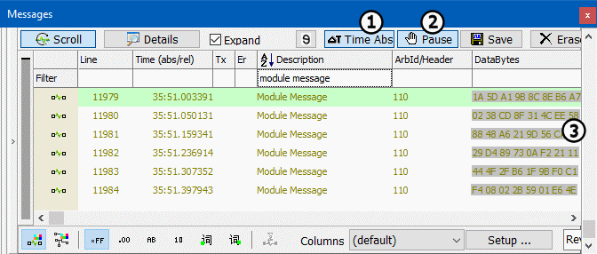

# Part 7 - Message Timestamps and Pausing

After finishing experimenting with the filter panel, include the **First Filter** only. In this exercise we will examine a couple of other important features found in Messages view.

### 1. Relative and Absolute Time:

Please click the **Scroll** button in Messages view if you are not already in this mode. You may have noticed the Time column in the display. Each message is recorded with its own unique time stamp. By default, Messages view displays the relative time for each message. Relative time is the time difference between consecutive messages. Click the **∆T Time Abs** button (Figure 1: ) at the top of Messages view to toggle to absolute time. This is the time of the arrival of the message since you started Vehicle Spy.

### 2. Pause:

When using Messages view, the ability to pause is very important. With scrolling on, click the **Pause** button (Figure 2: ). The scrolling stops and a scroll bar appears on the right side of the panel (Figure 1: ). Drag the scroll bar or use the page up/down keys to step through previous message traffic. The **Pause** button functions the same way in both scrolling and static modes.

