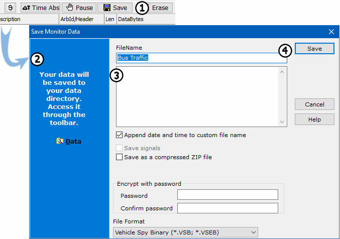
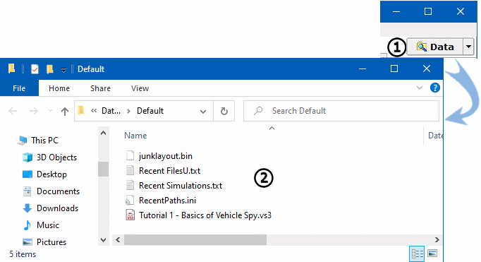

# Part 8 - Save Your Messages View Buffer

Vehicle Spy 3 Makes it easy to save the data you collect for later analysis.

### 1. Save Collected Buffer to Disk:

Click the **Save** button found at the top of the Messages view (Figure 1:).\
\
The **Save Monitor Data** dialog will open and fill the main workspace (Figure 1:). Under **FileName** enter a name for the data file or use the default name which includes the time and date. For this exercise, please call the file "\<Your Name> Data File".\
\
Directly below the **FileName** field, there is an additional blank field (Figure 1:). This area may be used to enter any notes that need saved along with the data. Select **Save** and data will be stored (Figure 1: ).

### 2. Open Your Data File:

When **Save** was selected in Step 1, the data was automatically saved in the Data Directory. This is a subdirectory named for a specific logon name. It serves as the default location for all data and settings. To quickly access the file just saved, click on the **Data** button located in the right of the Main Menu (Figure 2:).\
\
The data file is shown in the data folder attached to specific logon name being used. Double click on the data file (Figure 2:).\
\
The file will open in the default editor for \*.CSV (comma separated value) files. Excel or Notepad are the typical default editors. These files can also be opened in Vehicle Spy for review and analysis.

