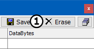

# Part 9 - Clear the Messages View Buffer

At some point, it may be necessary to clear all the data you have collected from Messages view.

### 1. Select Messages:

Select **Message**s view from your custom tab set.

### 2. Clear the Buffer:

Press the **Erase** button located in the upper right corner of the Messages View (Figure 1:).

### 3. Observe that Messages View has been Cleared:

Notice that the message counter column starts over again at one.

