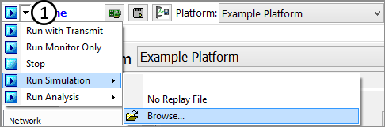

# Part 1 - Setup the Simulation

In this example a simulation file will be used. This will allow capturing data without being connected to a real bus. Simulation files are simply previously captured data files that are played back to simulate actual bus traffic.

### 1. Start Vehicle Spy

### 2. Start Simulation File:

Click the **pull down next to the Play button** (Figure 1:). Select **Run Simulation** if **AllBusTraffic.csv** is not already present select **Browse**. Locate the **AllBusTraffic.csv** file and select **Open**. After loading the simulation will begin immediately.

A simulation has been successfully setup. Now when the blue play button near the top left corner of the window is clicked, the simulation file will be viewed. If Messages view is not already open, select **Spy Networks > Messages** to see simulated traffic.
