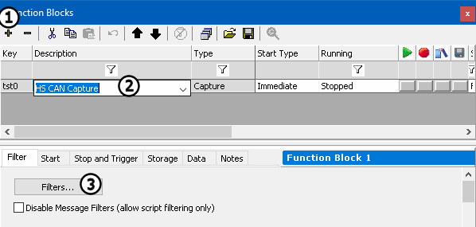
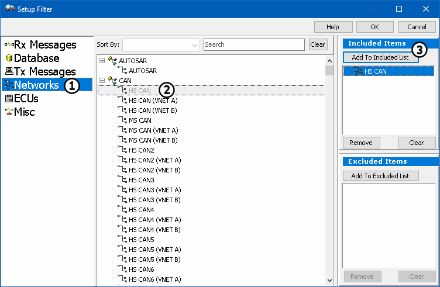
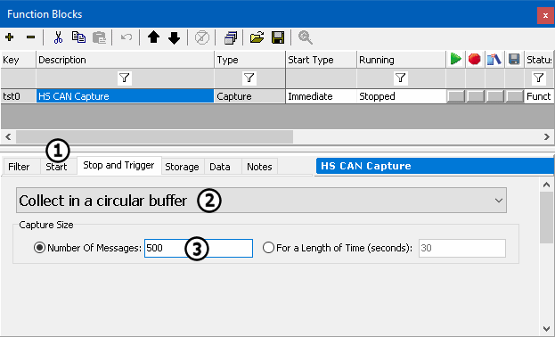
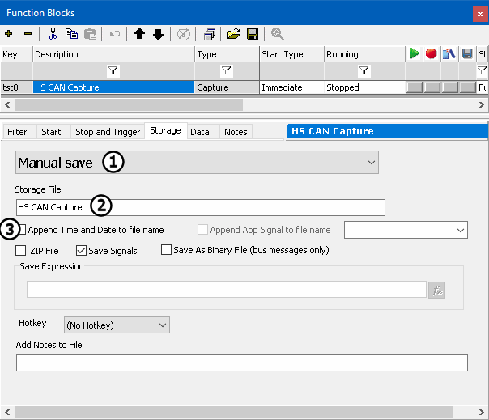

# Part 2 - Setup the Capture Function Blocks

A capture Function Block allows the recording of data that is coming across the bus. In this case, data that is captured will be coming from a simulation file. Capture Function Blocks can capture traffic in a variety of ways. To learn more about how to use Capture Function Blocks, see Capture Function Blocks.

### 1. Open the Function Blocks Tab:

Select **Scripting and Automation > Function Blocks** from the main menu.

### 2. Add New Capture Function Block:

Press the **+ button** (Figure 1:) at the top of Function Blocks view. A dropdown list of available function block types will appear. Select **Capture** and the new function block will be added to the list in the upper portion of the view. Label this Capture **HS CAN Capture** by double clicking the description field and entering in the text (Figure 1:).

### 3. Add Filters:

Filters choose what is to be captured. Under the Filter tab click the **Filters...** button (Figure 1: ). The Setup Filter dialog will appear (Figure 2). To create a filter for only HS CAN, select **Networks** (Figure 2:) > **HS CAN** (Figure 2:), and click **Add To Included List** (Figure 2:). **OK** will close the dialog.

### 4. Setup Capture Function Block:

Click the **Start** tab (Figure 3:) and make sure that the Function Block is set to **Start Immediately**. Next, click on the **Stop and Trigger** tab. Select **Collect in a circular buffer** from the dropdown (Figure 3:).Enter **500** for the buffer size (Figure 3:). This is approximately the number of HS CAN messages in the simulation file.

### 5. Setup Storage Options:

Click on the **Storage** tab and select **Manual save** from the first dropdown (Figure 5: ). This will allow saving in a number of different ways. Give the storage file a name by changing the text from Capture File Function Block 1 to **HS CAN Capture** (Figure 5: ). Make sure that **Append Time and Date to file name** is disabled by un-checking the checkbox next to this field (Figure 5: ).

### 6. Setup a second Capture Function Block:

Create a second Capture Function Block named **MS CAN Capture**. This will be set up the same as the previous Function Block except that for it will be for **MS CAN**and the **buffer size will be 370**.
