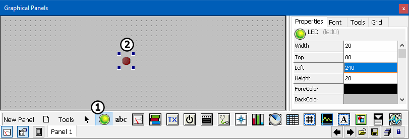
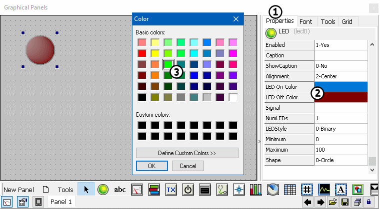
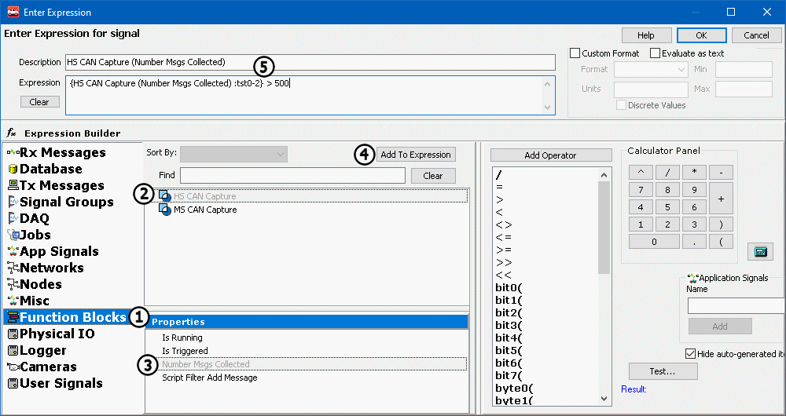
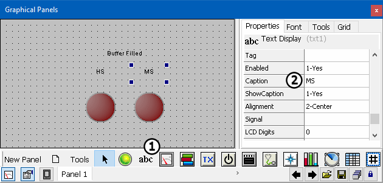
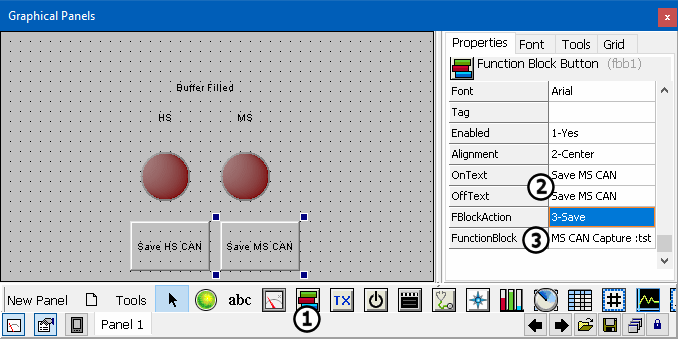

# Part 3 - Setup the Graphical Panel

Graphical Panels are similar to the graphical user interface (GUI) of an application. Once built, they allow a user having no knowledge of Vehicle Spy to perform complex tasks with Vehicle Spy. In this tutorial, a very basic Graphical Panel with only a few tools will be constructed. It is possible to have dozens of controls across multiple panels.

### 1. Open Graphical Panels Tab:

Select **Measurement** > **Graphical Panels** from the main menu.

### 2. Create a LED:

To add a control, click on the control from the palette, and click on the graphical panel where it needs to be. Start by clicking on the **LED control** (Figure 1:), then click anywhere in the graphical panel to place the LED. The LED should now appear in the graphical panel (Figure 1:). The LED can be resized by dragging the blue boxes surrounding it to the desired dimensions.

### 3. Configure the LED:

Click on the LED in the graphical panel. The Properties pane contains options for configuring the control. If the Properties pane is not visible, be sure that the LED and Properties Tab are selected (Figure 2:). From the Properties pane click once on the **LED On Color** property (Figure 2:) then double click to open a color picker where the On color of the LED can be selected. Make this LED green (Figure 2:). Do the same for the **LED Off color**, but choose a darker red as the color.

Double click the **Signal** property to open the Expression Builder. This property is what links the control to a Vehicle Spy data item.From the Expression Builder window, select **Function Blocks** (Figure 3:).A listing of Function Blocks that were previously created are now displayed in the center of the window (Figure 3:), select **HS CAN Capture**from this list. The **Properties** pane at the bottom will update with the available properties for the selected data item, select **Number Msgs Collected** (Figure 3:). Adding the selected item to the expression field can be done a few ways. Double click the item to add, or once it is selected press the **Add To Expression** button (Figure 3:). Once the property is added to the **Expression** field (Figure 3:) enter **> 500** (approximately the number of HS CAN messages in the simulation file) without quotes to the end of the text surrounded by braces {}. When the number of messages collected is greater than 500 the LED will be lit.

### 4. Configure Second LED:

Create and configure a second LED using the method above. This time use the **Number Msgs Collected** property of **MS CAN Capture** and instead of > 500 messages use **>370** messages.

### 5. Create Text Display tools:

Text display controls can be used to display text values, they can also be used as labels.This tutorial will use them to label the LEDs. Click on the **Text** tool (Figure 4:) and click anywhere in the graphical panel to place the tool. To choose text for the label, change the **Caption** property (Figure 4:)to the needed text.Change this caption to **Buffer Filled**. Place this text above the LEDs. Create two more labels, one **HS** and another **MS** for each LED.

### 6. Create Function Block Buttons:

Click the **Function Block** button (Figure 5:) and place it on the graphical panel. Once the button is placed, change the **OnText** and the **OffText** property to **Save HS CAN** (Figure 5:). Next, double click the **FBlockAction** property just below OffText and select **3-Save**. Double click the **FunctionBlock** property (Figure 5:) and select **HS CAN Capture** from the pull down. Create a second **Function Block button**. This time change the On and Off text to **Save MS CAN** and choose **MS CAN Capture** for the Function Block. Don't forget to change **Function Block Action** to **3-Save**. The Function Block buttons will save the Capture Function Blocks' buffers.

