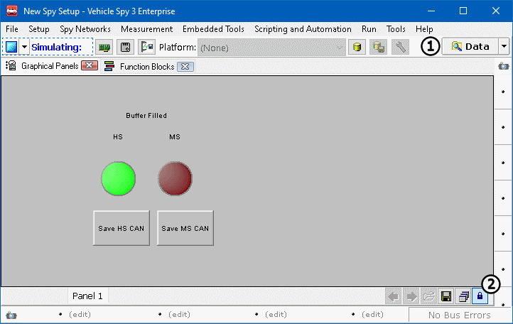

# Part 4 - Conclusion

To test the file, click on the blue **Play** button near the top left corner of the screen. When viewing from the Graphical panel, the LED for each channel should be red until the capture has filled its buffer. Once the simulation has finished one loop the LEDs will light nearly simultaneously. Now click the **Save** buttons for both Function Blocks to save the buffers to the data directory. The location of the collected data can be viewed by clicking on the **Data** button (Figure 1:). The Graphical Panel can be locked to keep the buttons from moving around using the **Lock** button (Figure 1:) in the lower right of the panel.

Congratulations the Graphical Panel is complete! Try completing a few exercises to build and reinforce Capture Function Block knowledge. Exercise 2 covers new concepts. The help documents are a great tools for learning new aspects of Vehicle Spy. For exercise 2 see Capture Function Blocks.

### Exercises:

1. Create a third capture, LED, and function block button for ISO9141/KW2K. Hint, there's approximately 145 messages per loop.
2. Create another Capture that collects intoa one-shot buffer, and is started by clicking on a function block button. Hint, use the FBlockAction property and Manual Start instead of Start Immediately.
