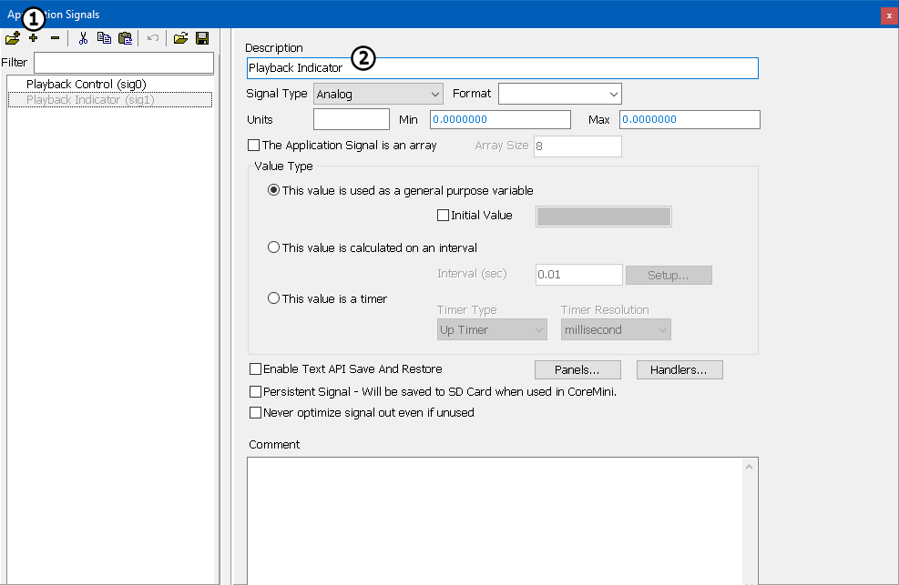

# Part 1 - Setup Application Signals

Application Signals are similar to variables in other programming languages, they store data inside the program. Application Signals in Vehicle Spy also store data. This tutorial will use application signals to toggle an LED and store the status of a button.

### 1. Start Vehicle Spy:

The first step in any Vehicle Spy project is to open Vehicle Spy.

### 2. Open the Application Signals Tab:

Select **Scripting and Automation > Application Signals** from the main menu.

### 3. Create an Application Signal:

Create an application signal by pressing the **+ button** (Figure 1:) near the top left of the tab. Name this application **Playback Control** in the **Description** field (Figure 1:). Create another application signal naming it **Playback Indicator**. The default settings will work for this tutorial.

