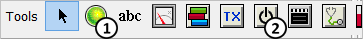
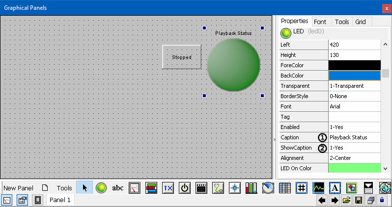
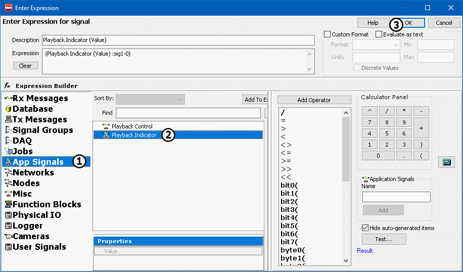

# Part 2 - Setup the Graphical Panel

Graphics Panels are similar to the graphical user interface (GUI) of an application. Once built they allow a user that has no knowledge of Vehicle Spy to perform complex tasks with the program. This tutorial will build a very basic Graphical Panel with only two tools. It is possible to have dozens of tools across multiple panels.

### 1. Open the Graphical Panels Tab:

Select **Measurement** > **Graphical Panels** from the main menu.

### 2. Create the necessary Tools:

Select the **LED Control** (Figure 1:) at the bottom of the screen. Click anywhere inside the Graphical Panel to place the LED. Next, select the **Power Control** (Figure 1:) at the bottom of the screen to add an on/off button. Click anywhere in the graphical panel to place the on/off button.

### 3. Change the Tool Properties:

Select the LED that was placed in the graphical panel. Once the LED is selected, find the **Caption** property (Figure 2:), and change it **Playback Status**. Select the **Show Caption** (Figure 2:) and select **1-Yes** from the pulldown. Select your **On/Off button** and change the **OnText** property to **Running** and the **OffText** property to **Stopped**. The caption for the On/Off Button changes depending whether it is set on or off.

### 4. Attach the Controls to the Application Signals:

Click the LED, then double click the **Signal** property from the right. This will open the [Expression Builder](../../shared-features-in-vehicle-spy/shared-features-expression-builder.md). From here, select the **App Signals** (Figure 3:) category from the left. Double click the **Playback Indicator** signal (Figure 3:) to enter it into the expression field. **OK** (Figure 3:) will confirm the changes. By default when the signal value that the LED is attached to equals 1, the LED will be lit. Now, do the same for the On/Off button, except this time double click the **Playback Control** application signal. The On/Off button will change the signal value to either a 1 or a 0 depending on it's position (on or off).

