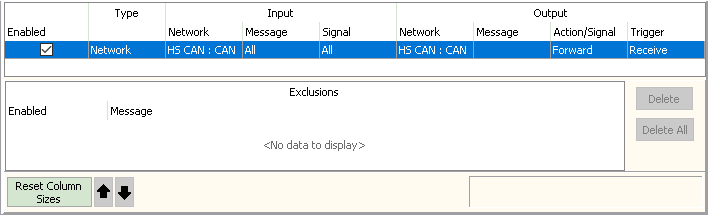
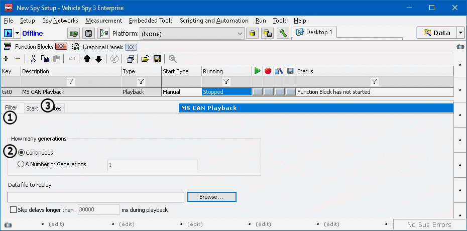

# Part 3 - Setup The Playback Function Block

### 1. Open the Function Blocks Tab:

In the main menu select **Scripting and Automation** > **Function Blocks**.

### 2. Create a Playback Function Block:

Click on the **+** **button** and then select **Playback** from the dropdown that appears (Figure 1). Set the name of the function block by double clicking on the description cell. Name this function block **MS CAN Playback**.

### 3. Setup Playback Function Block:

Select the **Buffer** tab (Figure 3: ), and make sure **Continuous** playback is enabled (Figure 3: ). Click the **Browse** button and find the **MS CAN Playback.csv** file downloaded from the intro page of this tutorial. Lastly, click on the **Start** tab (Figure 3: ) and select **Manual Start** from the first dropdown.

