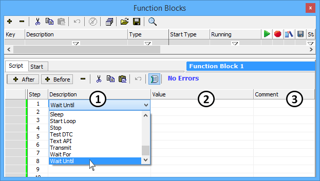
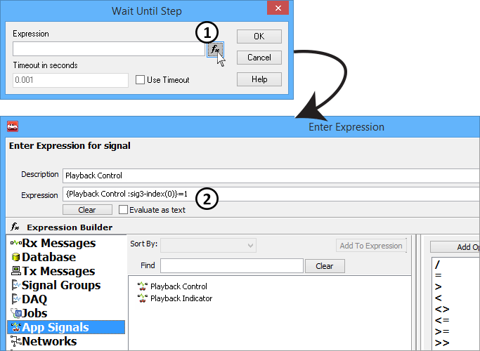
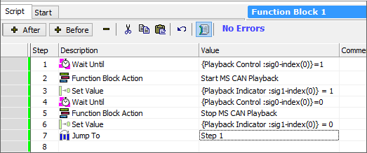

# Part 4 - Setup the Script Function Block

### 1. Create the Script Function Block:

Create a new function block in the same way as Step 2 on the previous page. This time select **Script** from the dropdown. Name this function block **Playback Control**.

### 2. Setup the Script Function Block:

To create a new step in a script function block, double click the **Description** cell (Figure 1: ), and select the desired step type from the dropdown. Next, the command needs to have instruction on what to do. This is done in the **Value** cell (Figure 1: ). Values will be specific to each type of step. Double click the **Value** field to enter in an equation. The **Comment** cell (Figure 1: ) is there to help you remember what each step of your script does. Feel free to use comments at will as they do not effect your script.

### Step 1: Wait Until:

Create the first step by double clicking on the **Description** cell (Figure 1: ) and selecting **Wait Until** from the dropdown. Next double click the **Value** cell (Figure 1: ). After double clicking the value cell, a small dialog will appear. Select the **fx** button (Figure 2:) to open the Expression Builder. Select **App Signals** from the left menu then double click on **Playback Control** to add it to the **Expression** field (Figure 2: ) near the top of the window. Enter **=1** after the text in braces **{}**. This step will wait until the On/Off Button on the Graphical Panel is depressed.

### Step 2: Function Block Action:

For step two create a **Function Block Action** for the Value select **Start** from the left, then **MS CAN Playback** from the right, then press **OK**. This step will start the Playback file simulating MS CAN.

### Step 3: Set Value:

Next, create a **Set Value** step by selecting it from the **Description** pulldown. For the **Value,** select **App Signals** then double click **Playback Indicator**. Now enter just the number **1** into the expression field near the top of the window. Set Value works differently than Wait Until, in that, the equals is implied and not necessary. This step will turn on the LED indicating that Playbackhas begun.

### Step 4: Wait Until:

Create another **Wait Until**. This time the **Value** will be wait for **Playback Control** to equal zero, entered in the **Expression** field.

### Step 5: Function Block Action:

Next, create another **Function Block Action** this time the action will be **Stop** the **MS CAN Playback** Function Block.

### Step 6: Set Value:

For this set value set the **Playback Indicator** back to**0**.

### Step 7: Jump to:

Lastly, create a **Jump To** that jumps to **Step 1**. Double clicking the **Value** cell and entering **1** will accomplish this. This ensures the function block restarts after its completed all of the steps.

### 3. End Result:

Once all of the steps have been added into the script it should look similar to **Figure 3.**

\*Note: The numbers after the text "sig" may differ. The "sig" number is an indexing number.
