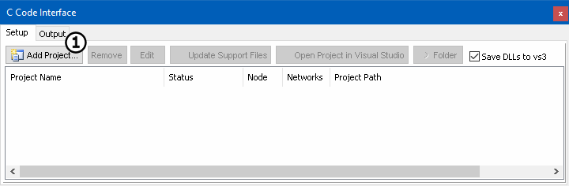
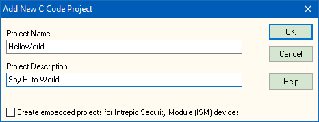

# Part 1 - Create a Project

### 1. Open Vehicle Spy and Access C Code Interface:

After logging in, open the **C Code Interface** by selecting **Scripting and Automation> C Code Interface**.

### 2. Add a Project:

A new project is added by selecting **Add Project** (Figure 1:) and then selecting **New Project**. Name the project and give a short description of the project (Figure 2). When done click on **OK**.  Visual Studio should open with the new project created.

### 3. Build and Run:

In Visual Studio, build your project. When done, start Vehicle spy. The Output tab should show **Another Second happened** about every second. This text is coming from the C Code. In Visual Studio the main project file is called **SpyCCode.c**. The Spy\_Main function is the one creating this string. Try changing the text to **Hello World of Vspy!**. Remember to stop Vehicle Spy and recompile for changes to take effect.
