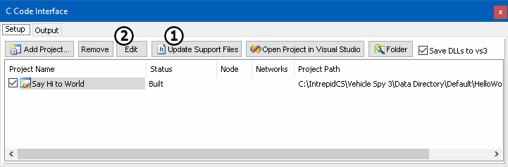
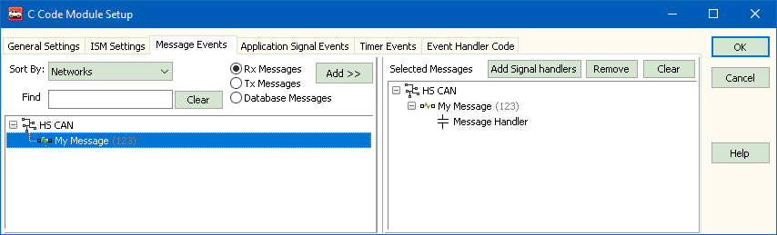
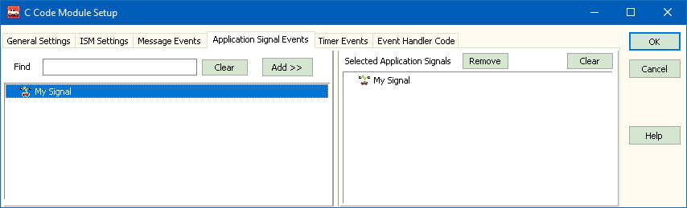

# Part 2 - Adding Events

### 1. Vehicle Spy Setup:

In this tutorial, 2 events will be added. The first when a message is received and the second is for an application signal changing. Create a **Receive message** with an **Arb ID of 123** named **My Message** and an **Application Signal** named **My App Signal.**

### 2. C Code Interface:

In the C Code Interface view under the Setup tab, select your project and click on **Update Support Files** (Figure 1:). This will add the new data items from Vehicle Spy to the header files. If Visual Studio is open, you may get a warning that files have been updated. Click on **Yes to All** to add the changes to your project.

### 3. Add Events:

With your project selected, click on the **Edit** button (Figure 1:). Being sure **Rx Messages** is selected, in **Message Events** tab select and add **My Message** (Figure 2). Under the **Application Signal Events** tab select and add **My App Signal** (Figure 3).  Next, go to the **Event Handler Code** tab and select **Copy**. This is the event code.  Paste this as new functions in your **SpyCCode.c** file in Visual Studio. \
\
For the SpyMsg\_MG\_My\_Message\_HS\_CAN event add **"printf("There's my Message!!!\n)";"**. For the SpyAppSign\_AS\_My\_App\_Signal add **"printf("App Signal changed\n");"**.

