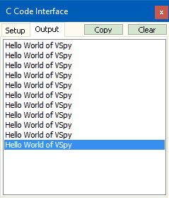

# Part 3 - Running the Example

### Run the Example

Compile the C code and run Vehicle Spy. In the Output window of Vehicle Spy, you should see the text that was applied to each event if that event occurs.  An easy way to change the application signal is in a graphical panel.

