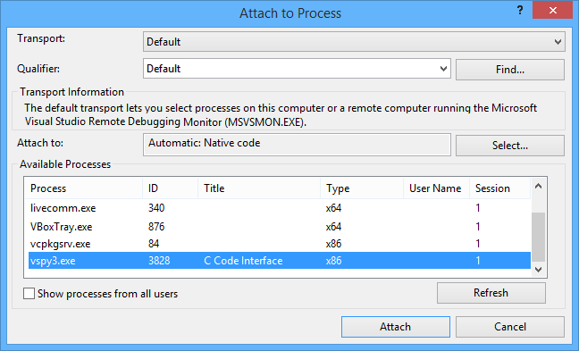

# Part 4 - Debugging

### Debug

It is possible to debug your code using the debugger in Visual Studio. After rebuilding your project, select **Tools>Attach to Process...**. from the main menu of Visual Studio. Select **Vspy3.exe** and click on **Attach**.

You can now run Vehicle Spy and have break points in your C code. Debugging your C code is done like any other C project.
