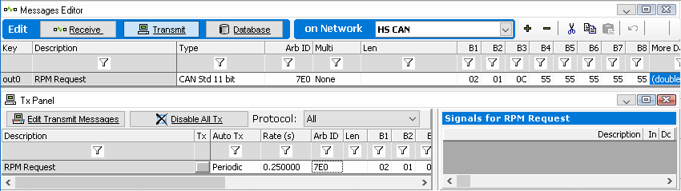

# Part 1 - Creating a Tx Message

### 1. Create a Tx Message:

Open Vehicle Spy and log in on the Logon screen. Next, create a transmit message with the following parameters (This is covered in more detail in [Tutorial 2](../tutorial-transmit-messages-with-vehicle-spy/)).

| Description | RPM Request |
| ----------- | ----------- |
| ArbID       | $7E0        |
| B1          | $02         |
| B2          | $01         |
| B3          | $0C         |
| B4          | $55         |
| B5          | $55         |
| B6          | $55         |
| B7          | $55         |
| B8          | $55         |

Once the Tx message is built, the periodic rate needs to be set.  This can be done in the Transmit panel.  For this message, set the periodic rate to .25 seconds.

When the CoreMini Script runs, it will send this request out every 250ms.
