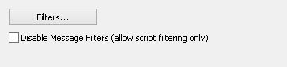
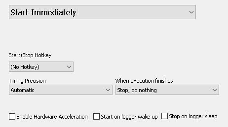
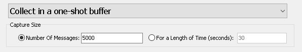
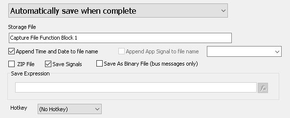

# Part 2 - Logging Data

### 1. Capture Function block:

The next thing to setup is a capture function block. This example will use a very simple setup.\
\
To start, open up Function Blocks from "Scripting and Automation" then " Function Blocks". Use the + to create a new function block and select Capture. A capture function block has a few options that need to be configured to tell it how to capture. Below are the settings needed for a simple CoreMini capture.\
\
**Buffer**\
In this section, you can select the messages you want to capture. The default is to capture all messages.  For this example, leave the default settings.

**Start**\
This section sets when to start the capture. For this example, select "Start Immediately". When the hardware is powered, it will start collecting messages. Also, check the "Automatically restart when complete".  With this option enabled, the hardware will create a new buffer once the current one is full. This will let the hardware capture continuously until power is disconnected.

**Stop and Trigger**\
This tab holds the settings for how to capture.  For a simple CoreMini capture, select "Collect in a one-shot buffer" and enter in 5000 messages for the buffer size. With these settings, the device will capture all incoming messages and split them into buffers of 5000 messages each.

**Storage**\
The settings in this tab tell how to save the data.  For this example, leave the defaults.

**Data**\
This tab shows the data that is being collected as the function block is running. This does not apply to CoreMini Logging. If this script was ran in Vehicle Spy, the captured messages could be viewed here.\
\
That's all that is needed to set up the capture.
