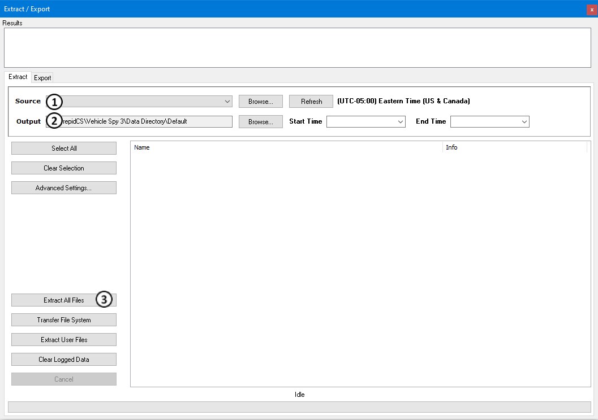

# Part 5 - Extracting Data

### 1. Micro-SD Card:

Vehicle Spy has a built in Extract tool will pull the data from the Micro-SD Card and copy it to the PC. The first step is to remove the card from the hardware and put it into the Micro-SD Card reader. After that, plug the reader with the card into the PC's USB port. Windows should detect the card as a disk drive. Note the drive letter Windows is using for the device.

### 2. SD Card Extract:

In Vehicle Spy, select Tools -> Utilities -> Extract / Export to open the extract function. Figure 1 shows this view.

The first step to using this function is to select the Source Data Drive to extract from (Figure 1: ). The drive will have the same drive letter as noted before and will have a label of "LOGGER" followed by the size. The next step is to tell the application where to put the data. This is done using the Browse button found in the "Output Directory" section in (Figure 1: ). The last step is to click the "Convert Log File" button at (Figure 1: ). This will take the data off of the SD card and put it into the specified directory. When finished, the Extract application will start Windows Explorer at the extracted file path.
