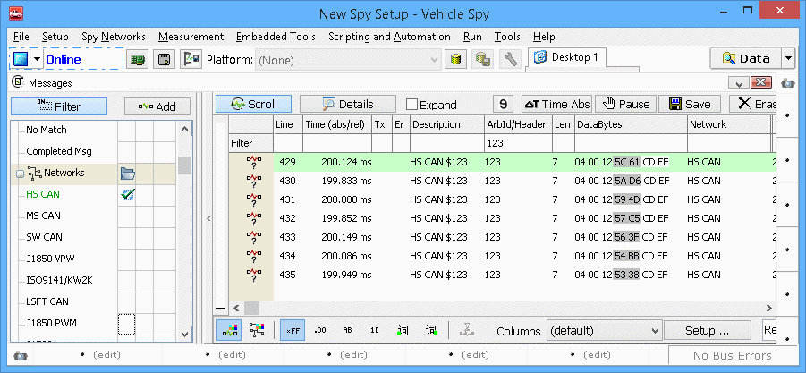

# Part 6 - Viewing the Data

### 1. Review Buffer:

Now that we have the data from the card, all that is left is to review the data. There are two ways to review the data captured in Vehicle Spy. The first is to select one of the \*.VSB files that was extracted from Windows Explorer and drag it into the Messages view of Vehicle Spy. The other is to go to "File", then "Review Buffer". From the Open dialog, select the \*.VSB that is to be looked at. Either method will fill the Messages view with the data that was collected from the capture. If you have a database configured, the messages will be decoded. Vehicle Spy's filters can also be used to narrow down the traffic so only the messages of interest will be shown. In your data stream, you should see the RPM Request. If you were connected to a vehicle that supports J1979 on HS CAN, you should also have a response with RPM data.

