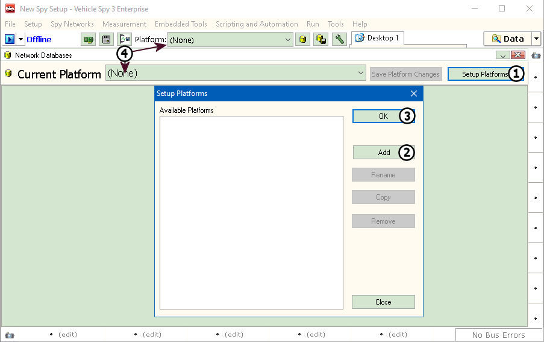

# Part 2 - Create a Platform

### 1. Create a Platform:

With Vehicle Spy open, select Setup -> Network Databases. A new Database Platform can be created by clicking on "Setup Platforms" (Figure 1: ). The Setup Platforms dialog will appear. This is screen is where platforms can be created, renamed, copied, and removed. For this tutorial, click on Add (Figure 1: ). A dialog will appear to create a name for the platform, enter in a name and click OK. "OK" (Figure 1: ) will close the Setup Platform dialog. The name can be almost anything, but the key is making sure it can be identified for what it was created for.\
\
The Platform and Current Platform dropdown will show a list of all the created platforms (Figure 1: ). This gives a quick easy way to change from one platform to another.

