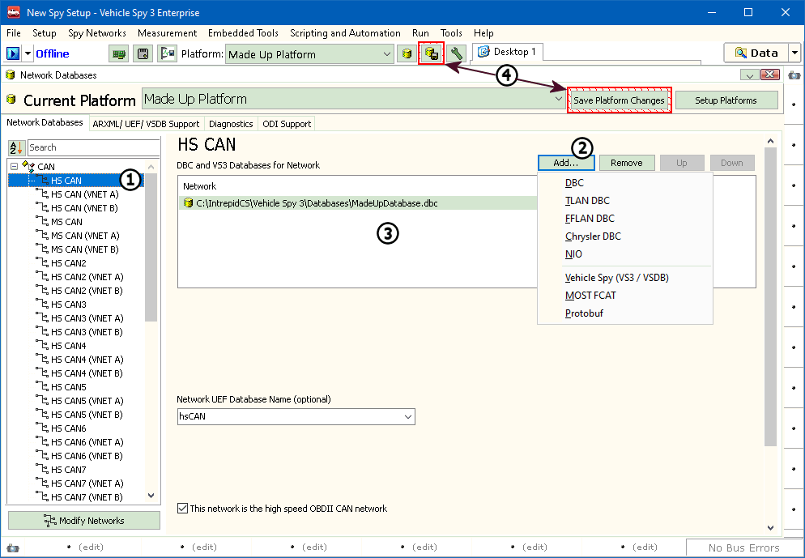
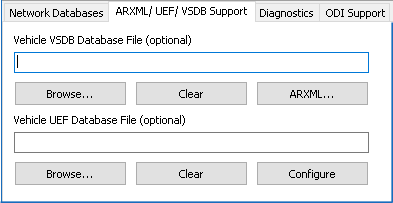
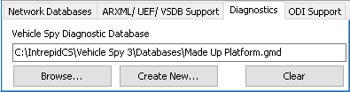

# Part 3 - Adding Database Files

### 1. Add Database files:

The next step is to add database files for the normal mode messages on the bus. Select the network to add the database to on the left (Figure 1: ). With the proper network selected, "Add..." on the right (Figure 1: ) can be clicked to select the type of database to load. Here you will find imports for a few different file types: \*.DBC, \*.VS3, and \*.VSDB. Other options will appear depending on the [OEM Specific Features](../../vehicle-spy-main-menus/main-menu-tools/tools-options/options-spy-networks-tab/) enabled under Tools -> Options. Selected Databases for the selected network are shown in the center of the screen (Figure 1: ). The location of the database can also be verified in this part of the dialog.

### 2. UEF and VSDB Support:

The tab for "UEF / VSDB Support" is where a UEF, VSDB, and ARXML databases can be configured (Figure 2: ). To add a database, click on Browse (Figure 2: ) and select the proper database file. The path will be shown in the box above the Browse button. If a UEF, VSDB, or ARXML file is not available, this can be skipped.

### 3. Diagnostic Database:

Diagnostic information is held in a different database. When a new platform is created, a new or blank database is created. The new database name matches the database platform name. This can be viewed in the Diagnostics tab (Figure 3).

### 4. Save:

The next step is to save! Saving can be done in a few different. The simplest is the "Save Platform Changes" button (Figure 1: ). This will flash with a red border to warn that things are not saved. Another way to save is to go to File -> Save Platform Changes.
