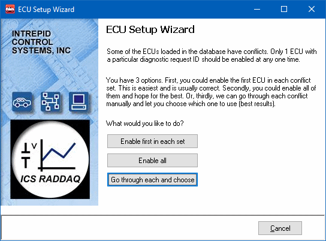
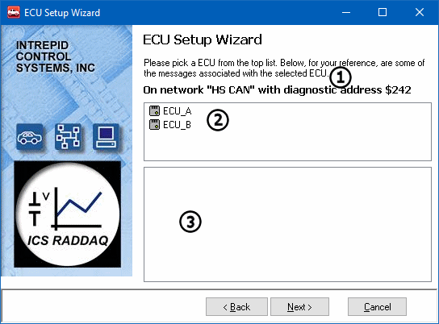

# Part 4 - ECU Setup Wizard

### 1. What is the ECU Setup Wizard:

The ECU Setup Wizard is a way to help clear ambiguity in databases that contain similar ECUs with conflicting messages. The ECU Setup Wizard should only appear if a conflict exists. Figure 1 shows the first screen of the ECU wizard. The best choice to make is "Go through each and choose". The other two options, Vehicle Spy will pick and it may not be correct for the target application. Using this option will bring up a list of conflicts and the proper ECU for the target vehicle can be selected. The options that are picked will also affect diagnostic database decoding. If there are no conflicts, this wizard will not be shown.

After clicking "Go through each and choose", the next step is to pick what ECUs are needed.The Network and diagnostic address is shown at the top of the dialog (Figure 2: ). The conflicting ECU names are shown in the box below (Figure 2: ). Items unique to the selected ECU will appear in the box at the bottom (Figure 2: ). With the proper ECU selected, click next to move to the next ECU.

When all the conflicts have been resolved, a prompt to save will be displayed. Once saved, the ECU Setup Wizard should not show up again unless a database changes or a new platform is created.
