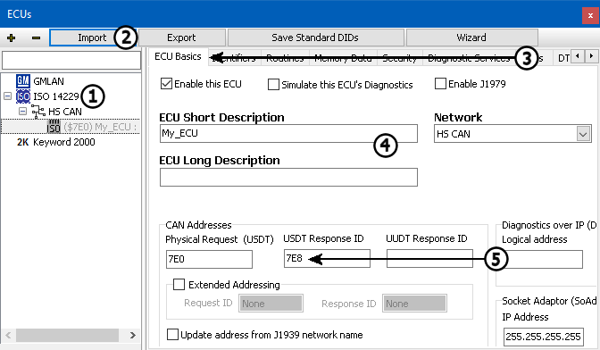
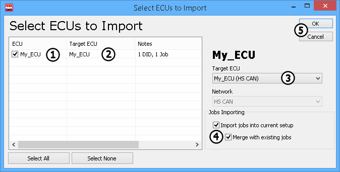
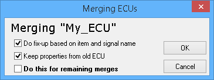

# Part 5 - Diagnostic Decoding

### 1. ECU Diagnostic Database:

The last step is to add any needed diagnostic information. Diagnostic information can come from a number of sources. The ECU Diagnostic Database can be accessed from Setup -> [ECU Diagnostic Database](../../vehicle-spy-main-menus/main-menu-setup/ecus-view/).\
\
The far left will show a listing of all the ECUs brought in from your [Network Database setup](../../vehicle-spy-main-menus/main-menu-setup/network-databases.md) (Figure 1: ). Selecting an ECU will display information on the right.

### 2. Import:

To import diagnostic data, click on "Import" (Figure 1: ) and select the database type. The database types are broken in to different types: [GMLAN](../../vehicle-spy-main-menus/main-menu-spy-networks/ecus-view/gmlan-ecus.md), [ISO 14229](../../vehicle-spy-main-menus/main-menu-spy-networks/ecus-view/iso-14229-ecus.md), [Keyword 2000](../../vehicle-spy-main-menus/main-menu-spy-networks/ecus-view/keyword-2000-ecus.md), ICS Database, or Memory information. To Import an ODX type file, select ISO14229, then ODX/PDX. Select the ODX file to load. A converter dialog will popup identifying any issues in the import, click Ok to move on.\
\
The Import dialog will pop up next. This screen is where the imported data can be mapped to the available ECU list. The ECU column (Figure 2: ) lists the ECU names present in the database that is being imported. The ECU name to link this data to is presented in the Target ECU column (Figure 2: ). If the correct name is not automatically selected, it can be chosen from the Target ECU drop down (Figure 2: ). Some ODX files have Diagnostic Jobs built in. Import options for diagnostic jobs is shown under Jobs Importing (Figure 2: ). "Import jobs into current setup" enables importing diagnostic jobs. The "Merge with Existing Jobs" option will update any jobs the currently exist in the database. OK (Figure 2: ), will confirm and start the import.

For each ECU with data to import, a Merging dialog will appear (Figure 3). This will ask how to add this new data. The options are explained below:

* Do fix-up based on item and signal name: Use of this option will use the signal names to match up new items with existing ones.
* Keep properties from old ECU: Checking this will keep old signals that are not defined by the new database.
* Do this for remaining merges: This option will repeat the above selections for the remaining ECU data to be imported.

### 2. Save:

The last thing to do is to save! Again, this can be done through File -> Save Platform Changes.
