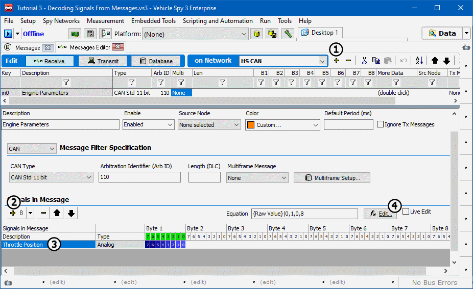

# Part 2 - Enter a Message

### 1. Create a Message:

Open up the **Messages Editor** panel in the main workspace using the custom tab set or by selecting **Spy Networks> Messages Editor**. Define a new **Receive message** for HS CAN by selecting **HS CAN** from the **on Network** pull down and clicking the **+ button** (Figure 1:).\
\
Using the **Setup** dialog, enter the following specifications:

**Description: Engine Parameters**\
**Type: Std 11 bit**\
**Arbitration ID: 110**\
**Choose Custom Color**

### 2. Create a Signal:

The lower portion of the Setup dialog contains a **Signals in Message** area. Click the **+ button** in this area to add a blank 8 bit signal specification (Figure 1:).

### 3. Enter a Signal Description:

Give the signal the description **Throttle Position**. This is done by double clicking the default description (Figure 1:) and typing in a new description.

### 4. Set Signal Decoding:

To tell Vehicle spy how to decode this signal, the **fx Edit** button (Figure 1:) can be clicked to bring up the decoding options.
