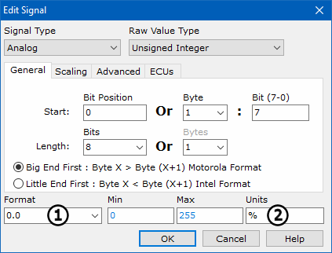
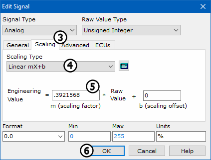

# Part 3 - Enter an Equation for an Analog Value

To indicate how the value is encoded in the Throttle Position signal, an equation needs to be entered for it.

### 1. Select Signal Type:

Throttle position can have many possible values. It is variable and therefore analog rather than digital. The signal type can be selected from the dropdown list at the top of the Edit Signal Dialog. Select **Analog** from the list for this example.

### 2. Select Signal Location:

Next, tell Vehicle Spy which bits and bytes in the message to decode. Click on the **Start Bit** field and make sure the **Bit Position** is set to **0**. The **Length** needs to be set to **8** bits. This setup will set the first byte of the Engine Parameters message as the raw value of the Throttle Position signal. Leave the endianness set to the default of **Big End First**.

### 3. Select Signal Format:

The **Format** option (Figure 1:) tells Vehicle Spy how to show the data returned.  Select **0.0** from the list. With this setting the signal will be displayed with one place after the decimal point. The minimum of 0 and the maximum of 255 will automatically populate.

### 4. Enter Units:

Type **%** in the **Units** field (Figure 1:). This will cause the Throttle Position values to be displayed with % as its engineering units.

### 5. Edit Equation:

Select the **Scaling** tab (Figure 1:). This tab is where the equation to convert raw data into real world engineering values is done. Select **Linear mX+b** in the **Scaling Type** field (Figure 1:). Enter a linear scaling factor of **0.3921568** in the **Engineering Value** field (Figure 1:). This value will scale an 8 bit value to a percent. (0.3921568 = 100 % / 255 bits).

### 6. Select Raw Value Type:

By default the Raw Value Type is set to **Unsigned Integer**.

### 7. Finish Equation:

Press **OK** to complete equation .

**\*Note:** If we were decoding digital signals, the procedure would be very similar. Simply select **Digital** for **Signal Type** and then enter the bit position for the signal.
