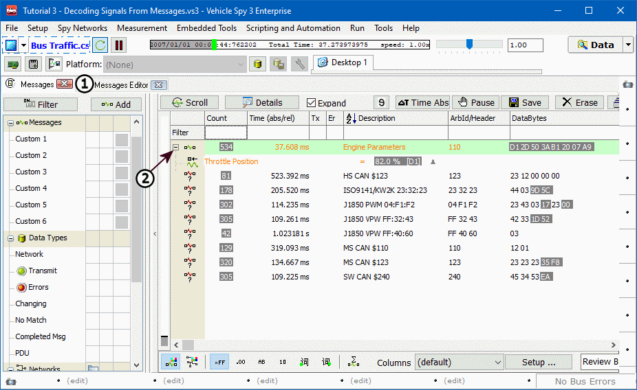

# Part 4 - View Message Data

Now let's take a look at the analog signal just built in action.

### 1. Create Message Filter:

Switch to **Messages** view (Figure 1:). Using skills from previous tutorials, set up a custom filter that shows just the Engine Parameters message. In this example this is not essential, but when working with many messages, a filter such as this would be very helpful. Press the **Start** button to start traffic.

### 2. View Message Traffic:

In static mode (scrolling turned off), notice the Engine Parameters message in the list in the custom color you specified.

### 3. Expand Message to Show Signals:

To the left of the message description is a small **+** (Figure1:). Click on this to expand the message. Now you can see the Throttle Position signal we defined within the Engine Parameters message. If more signals for this message had been defined, they would appear here as well. Click the **-** (Figure1:) to see only the message again.

### 4. Switch to Scrolling:

Select **Scroll** to switch the Messages view to scroll mode. Now is the time to turn on the filter completed in step 1. With the filter activated, just the Engine Parameters message is visible.  Press **Pause**. Note the **+** to the left of the message description just as in static view. Click on the **+** again to see the signal defined within the message.

**\*Note:** Activity Highlighting is automatically applied to signals as well as messages. In [Tutorial 1- Part 2](../tutorial-1-basics-of-vehicle-spy/part-2-monitor-message-traffic.md) this topic was covered briefly. Here are the basics of Activity Highlighting once more:

* All messages and signals that have been detected on the bus, even just once, are listed in Static mode.\
  &#x20;(In Scroll mode, they are all recorded as well, but depending on your buffer size, they may or may not be present.)
* Messages and/or signals that have recently changed are highlighted gray.
* Messages and/or signals that were present on the bus at least once but have not changed since are highlighted blue and gradually fade.
