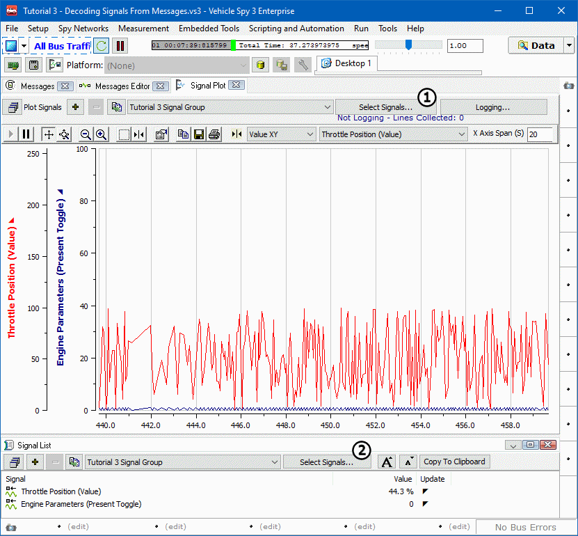
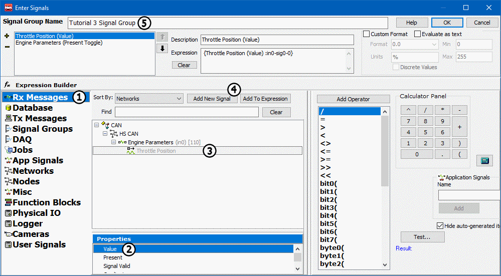

# Part 5 - View Message Data with the Signal List and Signal Plot

Vehicle Spy 3 includes tools for monitoring active signals.  Signal List shows the most current value of signal data in a grid. Signal Plot displays a strip chart plot of the signal data. In **Figure 1** Signal Plot is displayed in the main view with Signal List in the bottom alternate view.

### 1. Open Signal Views:

Under **Measurement** in the Main Menu bar, access **Signal Plot** and **Signal List**. Either view will allow you to create groups of signals called **Signal Groups**.

### 2. Build a Signal Group:

To build a signal group, click on the **Select Signals** button located on the Signals Plot or Signals List view (Figure 1:  & ). The Vehicle Spy Expression Builder opens (Figure 2). This is where signal selection occurs.

### 3. Select Data Source:

Each group defined can contain multiple messages and signals. The group can also contain multiple properties and values of these messages and signals. Begin by selecting your data source, **Rx Messages** (Figure 2: ), revealing all received messages and signals as defined in the Messages Editor.

### 4. Select Messages and Signals:

In the central network/message/signal tree area, select the message or signal desired to display (Figure 2: ). Next, in the **Properties** area, highlight the property to display. For this example, graph the **Present Toggle** property for the Engine Parameters message and the **Value** property for the Throttle Position signal (Figure 2: ). Click **Add New Signal** (Figure 2: )after each property selection to add to the Signal Group.

### 5. Name Signal Group:

Click in the **Signal Group Name** field (Figure 2: ) and type **Tutorial 3 Signal Group**.  This is an important step when working with multiple groups.\
\
Before clicking **OK** to return to a Signal view, double check the setup in the area just below the Signal Group Name field. This area displays all data included in the group. The selected property of each item is displayed in parentheses. The **+** and - symbols are used to add and remove items from the group.

