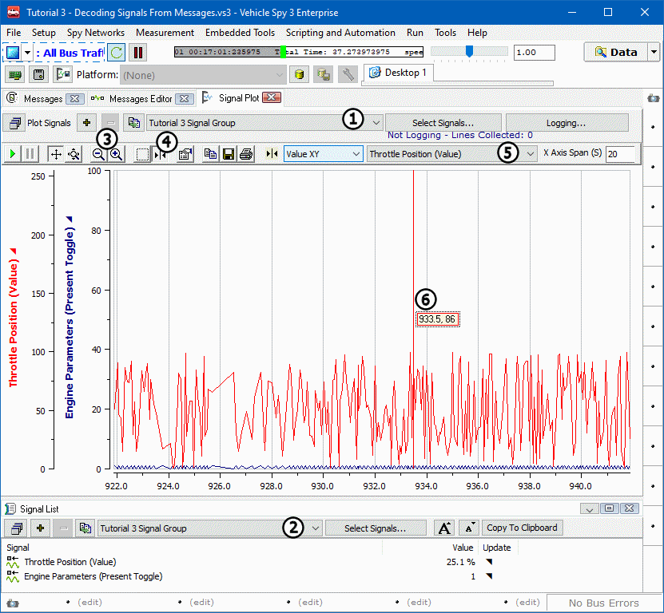

# Part 6 - An Introduction to Signal Plot Features

Signal Plot is a very powerful tool.  Below is a brief look at some of its capabilities.

### 1. Select Signal Group to View:

Signal Plot and Signal List can show two different Signal Groups simultaneously. Make these selections using the dropdowns found at the top of each view (Figure 1: & ).\
\
With the **Tutorial 3 Signal Group** selected, two Y-axis should be seen, each a different color and corresponding to a signal or message in the group. The X-axis represents time.

### 2. Try Tools from Toolbar:

Along the top of the Signal Plot graph, there is a toolbar. This contains all the tools needed to manipulate this view including: Play, Pause, Mousewheel Axis Control, Zoom (Figure 1:), Cursors (Figure 1:), Setup, Save, and Print.

### 3. Cursors and Cursor Control:

While many tools are self explanatory, the cursor tool requires some explanation. Click on the **Cursor icon** (Figure 1:) in the tool bar. A line with an adjacent box will appear on the graph. This is the cursor and it is used to make measurements. To the right of the toolbar, notice the two drop down fields. These control the cursor. The field farthest to the right is where a channel is selected. Select **Throttle Position** (Figure 1:) from this dropdown. The cursor changes to the same color as the Y-axis that correlates with Throttle Position.\
\
The other dropdown, to the left of channel selection, is where value to measure is determined. It is possible to choose to report X values, Y values, both X and Y, or even the difference between a pair of X values or a pair of Y values.\
\
Select the **Value XY** option and note that the box next to the cursor (Figure 1:) now displays those values.\
\
This concludes the abbreviated overview of the capabilities found in the Signal Plot. Hopefully this tutorial has sparked some interest and has encouraged experimentation with all of the features Signal Plot has to offer.
