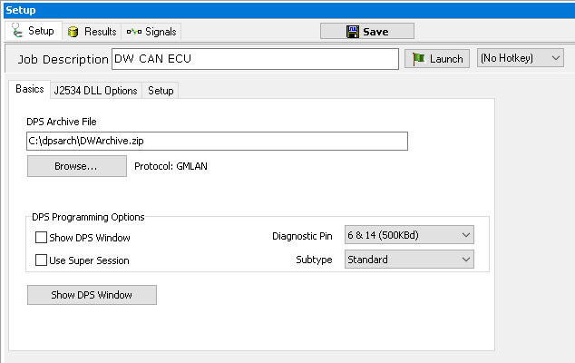
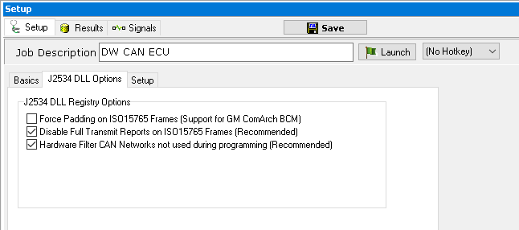
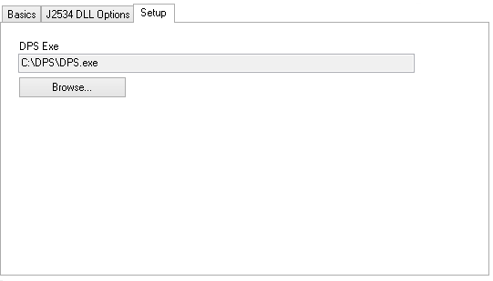

# Part 1 - Create DPS Programming Job

### 1. Logon to Vehicle Spy:

After Vehicle Spy is opened and a logon name is selected, use the main menu bar to select **File> New**.

### 2. Create a DPS Diagnostic Job:

Open the Setup Diagnostics window by using the main menu bar to select **Spy Networks> Diagnostics**. Use the **+ button** to add a **GMLAN > DPS Programming** job.

### 3. Edit Description and Basic Settings:

The first thing to change is the **Job Description**. In this tutorial, more than one DPS programming service will be setup. If the default descriptions are not changed, it will be difficult to tell them apart. Name this first DPS setup **DW CAN ECU**. Other important settings to verify in the **Setup** tab (Figure 1) are the DPS Archive File to program and the **Diagnostic Pins** to program on.

### 4. Verify the J2534 DLL Options:

The **J5234 DLL** Options tab (Figure 2) has options for configuring J2534 communication. Normally, the defaults are acceptable.

### 5. Verify the Location of DPS.exe:

The DPS Exe field on the **Setup** tab (Figure 3) should point to the location of the DPS.exe file. If DPS is installed in a different directory than what is shown, click **Browse** and select the proper directory.

### 6. Create Another Job:

Add a second DPS Programming service for a second ECU to program naming it **SW CAN ECU**. If you are following along with the finished example, change the DPS archive file to a valid archive file for both Diagnostic Jobs.
