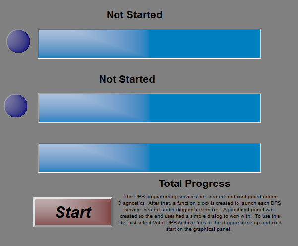

# Part 3 - Make a Graphical Panel

Let's make the DPS programming easier for the user by building a graphical panel.

### 1. Open Graphical Panels:

Select **Measurement> Graphical Panels** from the main menu. This is a chance to be creative! There is no real right or wrong way to make a graphical panel.

### 2. Build the Panel:

For this graphical panel 7 tools will be selected and setup from along the bottom of the screen. Some of the tools will be repeated, one for each DPS programming service.\
\
Build the panel using the following tools with instructions:\
\
**Function Block Button** to start the function block. The critical button properties to have set are:\
**FunctionBlock:** Program ECU\
**FBlockAction:** 0-Start\
\
**Text Display**\
**Signal:** Select **Jobs** and select the appropriate job. Select **Log and Value** property for the first service. (Make sure **Evaluate as text** is selected.) Repeat this for the second service.\
\
**Bargraph**\
**Signal:** Select **Jobs**, select **Percent and Value** property for the first service.\
**Min:** 0\
Repeat this for the second service.\
\
**LED**\
**Signal:** Select **Jobs**, select the first service and the **Is Successful** property.\
Repeat this for the second service.

With this setup, when the function block button is clicked, the DPS programming jobs will be started. The text displays will give the current text from the logs. The bargraphs will display the progress of the programming and the LEDs will turn on when the programming is complete.

