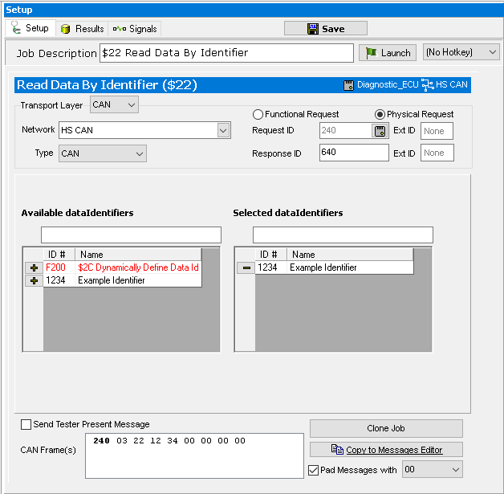

# Part 1 - Read Data By Identifier Setup

In this example, Identifier information acquired from Read Data By Identifier will be passed on to a Write Data By Identifier service. A use for this could be reading a VIN number, programming an ECU and then writing the VIN number back to the ECU.

### 1. Logon to Vehicle Spy:

After Vehicle Spy is opened and a logon name is selected, use the main menu bar to select **File > New**.

### 2. Create a Read Data By Identifier Job:

The next step is to create the diagnostic job to read a DID. Open the Setup Diagnostics screen using Vehicle **Networks > Diagnostics**. Use the **+ button** to add a **ISO 14229> $22 Read Data By Identifier job**.

### 3. Edit the Read DID Job:

The next step is to setup the Read Data by Identifier service. If connected to a vehicle or a bench with access to an Identifier that can be read and written, use this. Following along, this example will be setup for an example Identifier read. Select an ECU to Physically address (and network if not chosen from a database) and the Indentifier number. For the **Available dataIdentifier** select **ID# 1234** by clicking on the **+** button to the left of the ID #.

