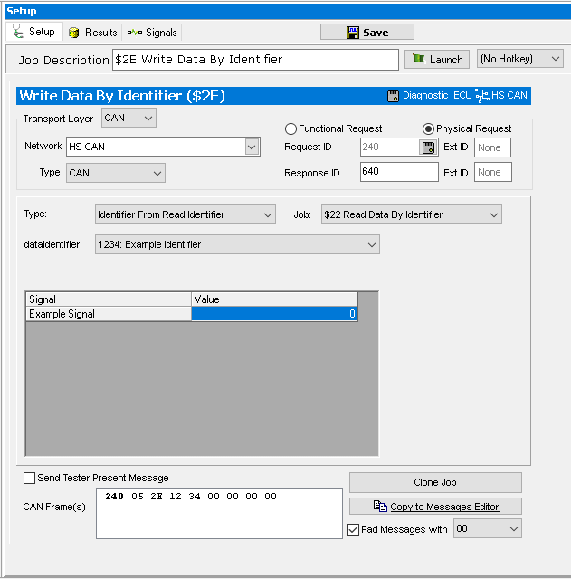

# Part 2 - Write Data by Identifier Setup

### 1. Create a Write Data by Identifier Job:

Use the **+ button** to add a **ISO 14229 > $2E Write Data By Identifier** job.

### 2. Select the Identifier to Write:

The next step is to select which DID to write to. Again, the Example Identifier number will be used as an example. If connected to a vehicle or a bench use the same Identifier as setup for the Read Data by Identifier in Part 1. Select an **ECU to Physically address** (and network if not chosen from a database).

### 3. Select the Data to Write:

The last thing to setup is the link between the Write Data by Identifier and Read Data by Identifier services. Underneath the Identifier Number selection, choose how to enter the data to be written. Select **Identifier from Read Identifier** from the **Type** drop down and the **Job** drop down will appear. Find the Read Data by Identifier service to link to in the drop down list and select it. For this example there should be 2 identical services to choose from, **$22 Read Data by Identifier**, once from the ECU job, and the job created in the last step. Select either option to before you continue.

