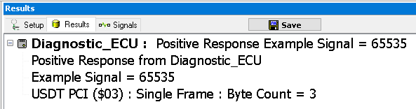

# Part 3 - Writing the Read DID

### 1. Run the Read DID Job:

From the Diagnostics screen (**Vehicle Networks > Diagnostics**). Run the Read DID service. If connected to hardware that is connected to a bench or vehicle, the requested data should be received.

### 2. Run the Write DID Job:

Now run the Write DID service. The service will write the VIN (or other selected DID) to the ECU with the data provided by the Read DID job.\
\
This just shows one simple example. A different ECU could have been selected for the Write DID service. Another variation of this example could include a DPS programming action in between the Read DID and Write DID. This way when the programming is complete, the VIN and other parameters can be put back in the ECU.

