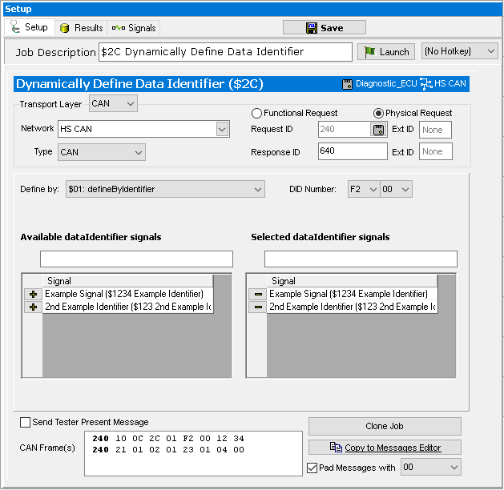

# Part 4 - Request Identifiers using Dynamically Define Data Identifier

In Parts 4 and 5, Identifiers are going to be requested through the use of a dynamic Data Identifier. This will be accomplished by using diagnostic services **Dynamically Define Data Identifier ($2C)** and **Read Data by Periodic Identifier ($2A)**.

### 1. Create the PIDs:

Like before, this example can work with hardware. If hardware is not available, it can still be followed to understand the procedure. The first step is to make sure Identifiers are defined for the ECU that data is to be requested from. This information is entered under **Spy Networks> ECUs**. Select the ISO 14229 ECU, then click on the **Identifiers tab** and enter in the Identifier data. For more information see the [ECUs view](../../vehicle-spy-main-menus/main-menu-setup/ecus-view/edit-ecu-diagnostic-database.md) help topic.

### 2. Build the Dynamic Identifier:

The next step is to create the dynamic identifier to request the identifier data. On the **Diagnostics** screen (**Spy Networks > Diagnostics**) add a **ISO 14229> $2C Dynamically Define Data Identifier**. Select the ECU and the Network Type. Select an Identifier from the dataIdentifiers Available list and click the **Add >>** button to place it into the dynamic identifier (Figure 1).

