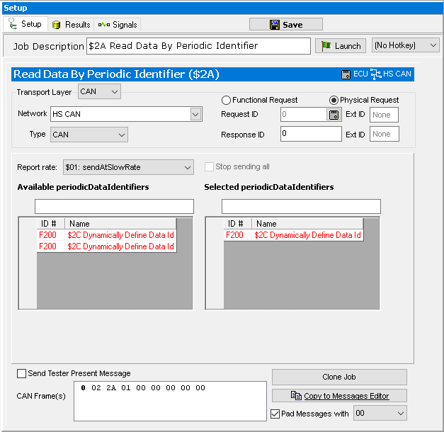

# Part 5 - Request the Dynamic Identifier

### 1. Build the Dynamic DPID Request:

The last setup step is to request the Dynamic Identifier. This data can be accessed using the Read Data By Periodic Identifier service ($2A). In Setup Diagnostics add a **ISO 14229 > Read Data By Periodic Identifier service ($2A)**. Next, setup the ECU ID and the network. Set the **Report Rate** set to the speed you want the Dynamic Identifier to report at. To link the Dynamic Identifier to the Read Data by Periodic Identifier service, click on the **+** button next to the Dynamically Define Data Identifier service that was set up in the previous step.

### 2. Request the Identifiers:

Now everything needed is setup to request Identifiers. From the Diagnostics screen (Vehicle Networks > Diagnostics) launch the Dynamically Define Data Identifier service. If a positive response is received, run the Read Data by Periodic Identifier service next. The requested data from the Identifiers should be displayed. Notice Vehicle Spy has decoded the Identifiers using the diagnostic database decoding that was setup under ECUs view.

