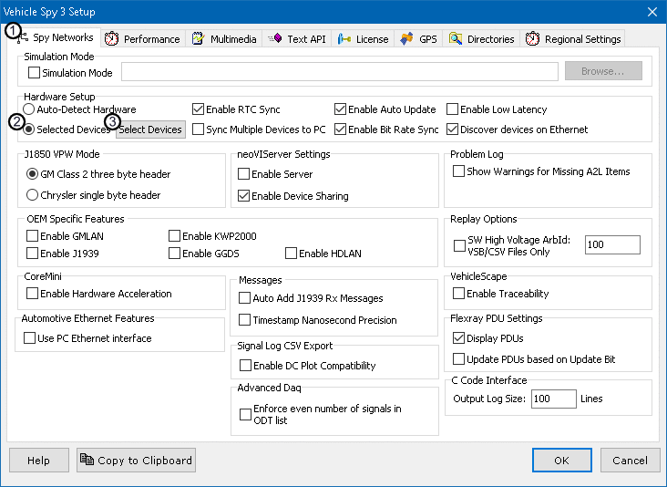

# Part 1 - Enabling Multiple Devices

### 1. Navigate to options:

The first part of setting up multiple devices is enabling the setting. Once Vehicle Spy is open, click the **Tools** button at the top and select **Options** from the drop down menu.

### 2. Check Selected Devices:

Make sure the menu is on the **Spy Networks** tab (Figure 1:) and then check the "**Selected Devices**" bubble (Figure 1:) to enable the **Select Devices** button (Figure 1:).

