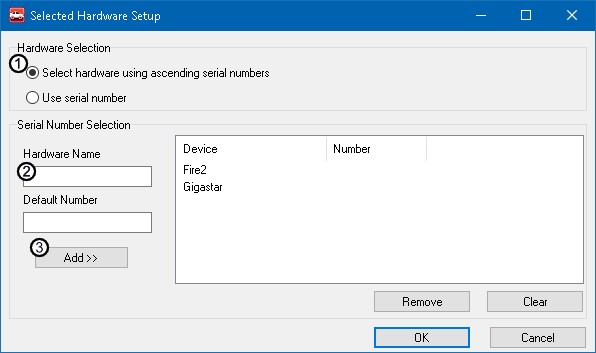

# Part 2 - Adding Devices

### 1. Select devices:

Once Selected Devices is checked, click on the "**Select Devices**" button.

### 2. Ascending serial numbers:

Inside of the Selected Hardware Setup popup, verify "**Select hardware using ascending serial numbers**"(Figure 1

:) is checked before the next step. The Ascending serial number option works best for this application and is a simple way to predict what device is being referenced. It also allows the ability to swap the hardware without changing the entire setup. As an example: A serial sumber starting with CY comes alphebetically before a serial number starting with GS, so a FIRE will always be before Gigastar.

### 3. Add names:

Type in a friendly name (Figure 1:) for the device and then click **Add** (Figure 1:**)**. The name could be anything to help identify which device is being utilized in the setup. This can be done for however many devices are being worked with. Serial numbers do not need to be added to the entries. Once the devices have been added, click OK and then OK again to exit out of the options menu.

