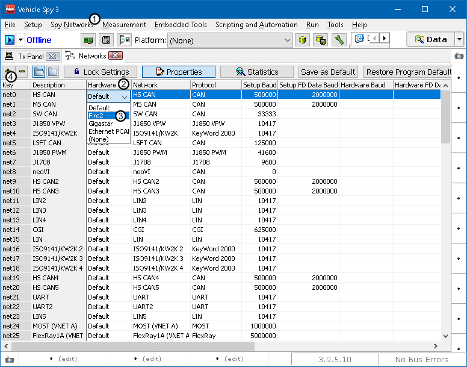

# Part 3 - Assigning Devices

### 1. Open networks:

Once the devices are added to the multi-device list, open the Networks menu. This menu can be found by clicking on the **Spy Networks** (Figure 1:) tab at the top of Vehicle Spy and selecting the **Networks** option.

### 2. Set the hardware entry:

Double click under the hardware column (Figure 1:) on the network that is being used. Set the hardware entry to the proper device in the hardware list (Figure 1:). Default is the first device. Additional networks can be added by clicking the + (Figrue 1:) at the top left of the Networks page.

