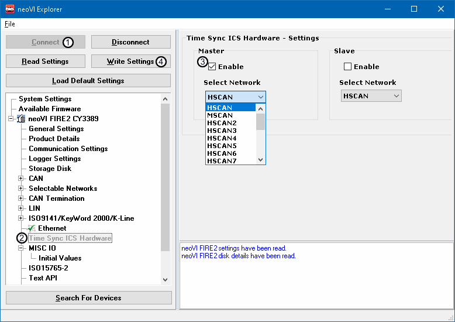

# Part 4 - Syncing Time Across Multiple Devices

### Time Syncing devices:

Time sync is crucial to verifiying the communication between devices is precise and there are no discrepancies. It is also important in making sure all traffic is timed accurately and efficiently.

### 1. Connect to the device:

In order to use Time Sync, it needs to be enabled on the device. Connect to the device by clicking on the **Setup** tab in Vehicle Spy and selecting the **Hardware** button. Once neoVI Explorer launches, click on the device and **Connect** (Figure 1:).

### 2. Enable Time Sync ICS Hardware:

Scroll down the list of options inside of the device and find the option labeled "**Time Sync ICS Hardware**" (Figure 1:) Click on this option and set it to **Master** (Figure 1:). Any other devices are required to be set to **Slave.** Once the changes have been made, be sure to click "**Write Settings"** (Figure 1:**)** before disconnecting from the device.

