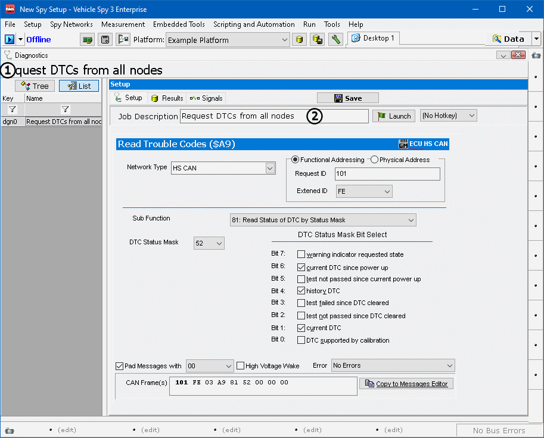

# Part 1 - Create a Diagnostic Job

Part 1 will begin by making a diagnostic job to request trouble codes.

### 1. Logon to Vehicle Spy:

After Vehicle Spy is opened and a logon name is selected, use the main menu bar to select **File > New**. For this tutorial the logon name is more important than usual. The data collected will be saved in the selected users data directory.

### 2. Create a Request DTC Job:

The next step is to create the diagnostic job to read DTCs. Open the Diagnostics screen using **Vehicle Networks> Diagnostics**. The screen should default open on the **Setup** tab. To add a job, use the **+ button** (Figure 1:) and select **GMLAN > $A9 Check Codes** job from the pull down. (This example will work with any diagnostic service.)

### 3. Verify Settings and Edit the Description:

For the purpose of this example the default settings will work. The diagnostic job will request DTCs from all functioning ECUs on the High Speed CAN network of a GMLAN vehicle. Change the **Job Description** (Figure 1:) to **Request DTCs from all nodes**. The setup should look like **Figure 1** below.

