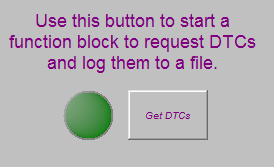

# Part 3 - Make a Graphical Panel

Make requesting trouble codes easier for the user by building a graphical panel.

### 1. Open Graphical Panels:

From the main menu select **Measurement > Graphical Panels**. This is a chance to be creative! There is no real right or wrong way to make a graphical panel.

### 2. Build the Panel:

For this graphical panel, 3 tools will be selected from along the bottom of the screen and setup.\
\
The first is a **Function Block Button** to start the function block. The critical button properties to have set are:\
\
**FunctionBlock:** Check Codes and Log Them to a File\
**FBlockAction:** 0-Start\
\
This will cause the button to start the function block every time the button is clicked.\
\
Next, add an **LED** to let the user know that the code request is still in progress. Draw an LED and set the **Signal** property. Select the diagnostic job created under **Jobs** with the **Is Running** Property.\
\
Lastly, using a **Text Display** add some text to explain what the button does using the **Caption** property. **Figure 1** shows a finished example.

