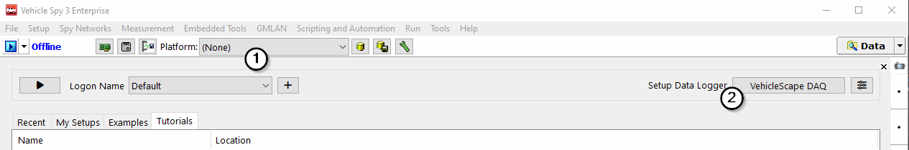

# Part 1 - Getting Started

### 1. Open Vehicle Spy and Log in

### Prepare for logging:

[VehicleScape DAQ](../../vehicle-spy-main-menus/main-menu-measurement/vehiclescape-daq/) will be used to select and read signals of interest. In most cases a database platform will be needed to define signals to select. The signals to select can be from normal mode messages that are present during normal operation of the bus, from diagnostic messages that must be requested, or XCP/CCP requests. In most cases this information comes from the database platform.

If database files are not available, signal information can be typed in the [Messages Editor](../../vehicle-spy-main-menus/main-menu-spy-networks/message-editor/). If requests are needed to acquire the signals of interest, requests can be built in the transmit table of the [Messages Editor](../../vehicle-spy-main-menus/main-menu-spy-networks/message-editor/). The one instance where a database of any type is not needed is if all the messages are to be collected with no type of trigger.

Here are links to tutorials to some of the features mentioned.

 [Transmit Messages with Vehicle Spy](../tutorial-transmit-messages-with-vehicle-spy/)\
\
 [Decode Signals From Messages](../tutorial-decode-signals-from-messages/)\
\
 [Database Setup](../tutorial-database-setup/)

### 3. Select a Platform:

The next step is to select the platform to be used for the capture. This can be done right from the logon page when the program starts. Use the **Platform** or the **Current Platform** dropdown (Figure 1:) to select a platform . The signals and channels used in this example are made up.

### 3. Select a Platform:

The next step is to select the platform to be used for the capture. This can be done right from the logon page when the program starts. Use the **Platform** or the **Current Platform** dropdown (Figure 1:) to select a platform . The signals and channels used in this example are made up.

### 4. Open VehicleScape DAQ:

Now open VehicleScape DAQ. This can be done using the **VehicleScape DAQ** button (Figure 1:) or by selecting **Measurement> VehicleScape** DAQ from the main menu.
