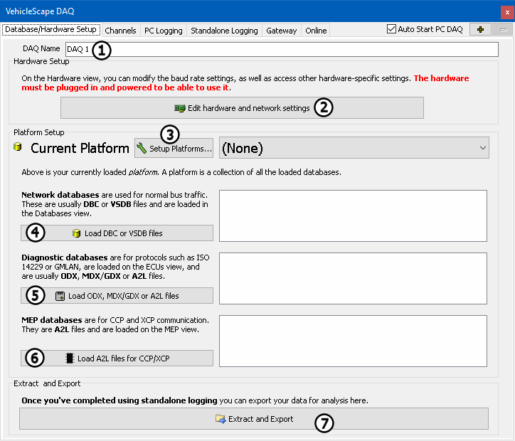

# Part 2 - Database/Hardware Setup

### Database/Hardware Setup tab

The Database/Hardware Setup tab gives an overview of the hardware and database settings to be used.

**DAQ Name** (Figure 1:), gives an option to name the DAQ Setup. For this example leave the default. Changing the name is useful when more than DAQ is put together. Hardware settings can be altered using the **Edit hardware and networks settings** button (Figure 1:). The buttons for **Setup Platforms** (Figure 1:), **Load DBC or VSDB files** (Figure 1:), **Load ODX, MDX/GDX or A2L Files** (Figure 1:) , and **Load A2L files for CCP/XCP** (Figure 1:) shouldn't be needed if the selected platform is correctly configured. If something is missing, use the button that matches what needs to be altered.

For more information on the options on this tab, click the link for [Database/Hardware Setup Tab](../../vehicle-spy-main-menus/main-menu-measurement/vehiclescape-daq/vehiclescape-daq-database-hardware-setup-tab.md) entry in the help.
