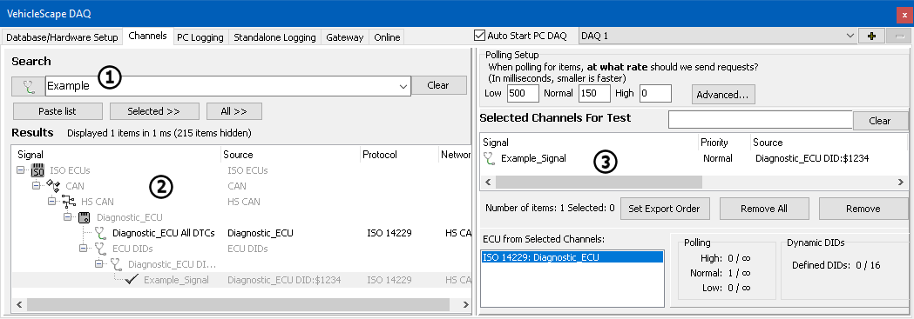

# Part 3 - Channels

### Channels Tab

The channels tab is where what to log is selected. The **Search** box (Figure 1:) gives a quick way to find the signals of interest. The information that is searched through comes from the applied platform and receive table. If the goal is to log everything, this step can be skipped.

Search results will be displayed in the **Results** box (Figure 1:). Double clicking on a result will add it to the **Selected Channels for Test** list (Figure 1:). Remember that the channels can be normal bus traffic, diagnostic information, CCP/XCP, or data from receive messages defined in the receive table of the messages editor. Vehicle Spy will figure out how to get that data.

For this simple example, the channels tab will only be used to select the channels to capture. Channels tab is also used to configure how diagnostics are requested, polling rates, decimation, export order, and other parameters. For more information see the help topic for the [Channels table of VehicleScape DAQ](../../vehicle-spy-main-menus/main-menu-measurement/vehiclescape-daq/vehiclescape-daq-channels-tab.md).

