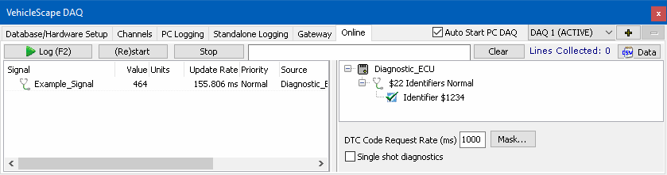

# Part 4 - Checking Channel Selection

### Verify Signals

This is not a required step, but a recommended one. The online tab will connect to hardware and start acquiring the selected channel data. This gives a chance to verify that the requested signals are correct, data rates are what is expected, and make sure diagnostic requests are being reported correctly.

When viewing the **Online** tab (Figure 1), signal values and update rates are viewed on the left and the status of diagnostic requests can be viewed on the right. If everything looks OK, move to the **Standalone Logging** tab to build the logger.

For more information on the Online tab, see the help topic for the [Online tab](../../vehicle-spy-main-menus/main-menu-measurement/vehiclescape-daq/vehiclescape-daq-online-tab.md).
