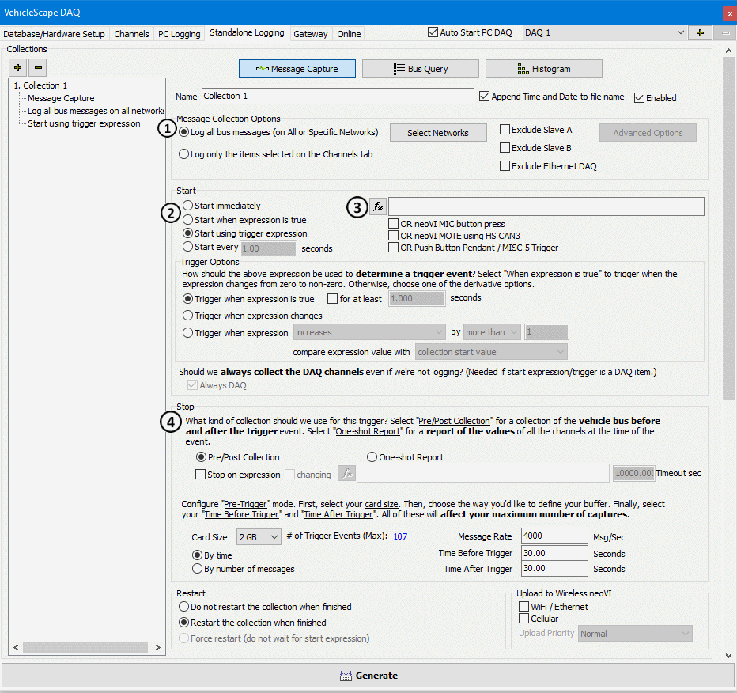
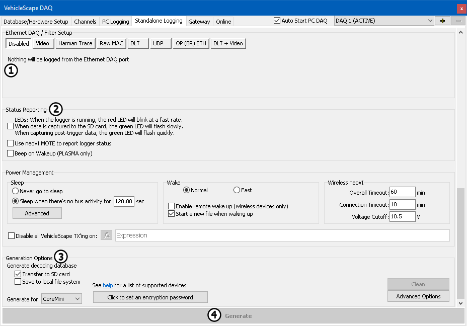

# Part 5 - Standalone Logging

### 1. Build a Standalone Logging Setup:

The **Standalone Logging** tab (Figures 1 & 2) looks a little overwhelming at first. Taking a closer look, it should be noted that that it is broken down into sections with simple options for how, what, and when to collect data. Details on all the options are in the help topic for the Standalone Logging tab. In this example we will cover the options needed for our original goal of a simple logging setup that uses a pre-post collection.

### 2. Set up Message Collection Options:

The **Message collection Options** (Figure 1:) gives options of what to log. The options are to log everything the hardware sees, or just the signals selected on the channels tab. For this example, **Entire Bus** will be selected to acquire everything the hardware sees.

### 3. Set up Collection Start Options:

The **Start Options** (Figure 1:) tells Vehicle Spy when to start logging. In this example a triggered pre-post capture will be created. Select **Using Trigger Expression** for this example. The next step is to create a trigger condition using the  **button** (Figure 1: ) and the Expression editor. In this example, the value of a signal collected is examined. This could be any expression that can be built in the expression editor.

### 4. Set up Collection Configuration:

The next step is to set how many messages to collect. This is done in the **Stop** section (Figure 1:). The default is to finish after collecting 30 seconds of data before and after the trigger event.

### 5. Ethernet DAQ / Filter Setup:

The Ehthernet DAQ / Filter Setup is used in specific configurations to collect specific protocols or data types (Figure 2:). Its use is covered elsewhere in the documentation. For now, move on to the next section.

### 6. Set up Reporting Options:

The lower part of this dialog has settings for the hardware. The first section is to set up **Status Reporting** (Figure 2:). This gives feed back on what the hardware is doing while it is logging. For this example leave the LEDs option enabled. On a neoVI FIRE, neoVI RED, or neoVI Yellow this will blink the red LED to allow the ability to verify it is running and the green LED will flash as data is being saved to the SD Card. When the capture is triggered, the green LED will flash faster to show this.

### 6. Set up Generate Options:

Options for creating a decoding database and sending the script to the device are given in the **Generate** section. The option of **Generate decoding database** (Figure 2:)and **Transfer to SD Card** will make a .VSDB file to decode logged data. The option to Transfer to the SD card will save this file on the SD card. When the data is extracted, the .VSDB will also be extracted to the same directory as the data that was collected. This helps keep it all organized.

The last thing to do is click **Generate** (Figure 2:). This will build all the function blocks needed to perform the actions configured in the Standalone logging tab. Once everything has been built, the CoreMini Console will load the script.
