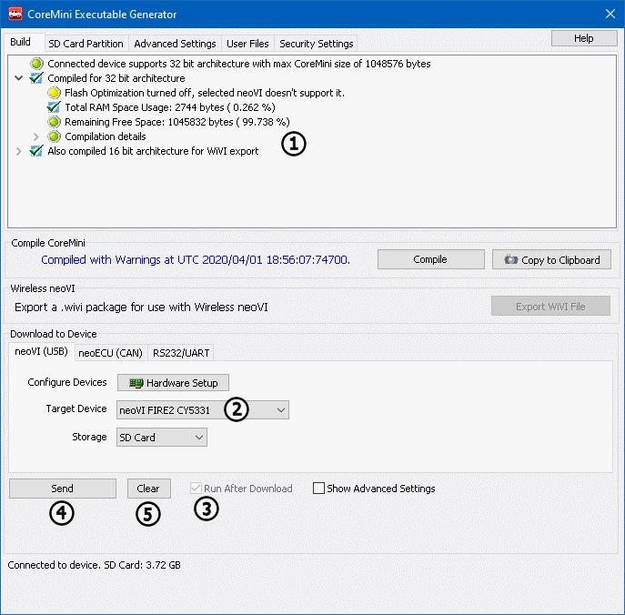

# Part 6 - CoreMini Console

### 1. Configure the CoreMini Console:

The CoreMini Console has a lot of information regarding the setup that is to be transferred. The output list (Figure 1:) will notify you of any errors or warnings. If any problems exist in the script, a red dot will be next to that item to warn you that something is wrong. The **Device** section (Figure 1:) selects which of the connected hardware to send the script to. **The Run CoreMini After Download** checkbox (Figure 1:)tells the hardware if it should run the script after it is loaded. If this is unchecked, the script will not run until the unit is re-powered. The **Send** button (Figure 1:) will send the script to the hardware. Remove scripts from the harware by selecting the **Clear** button (Figure 1:). More information on the Coremini Console can be found [here](../../vehicle-spy-main-menus/main-menu-tools/utilities-coremini-console/).

### 2. Connect to Vehicle or ECU:

The next step is to connect to a Vehicle or ECU and collect data!
