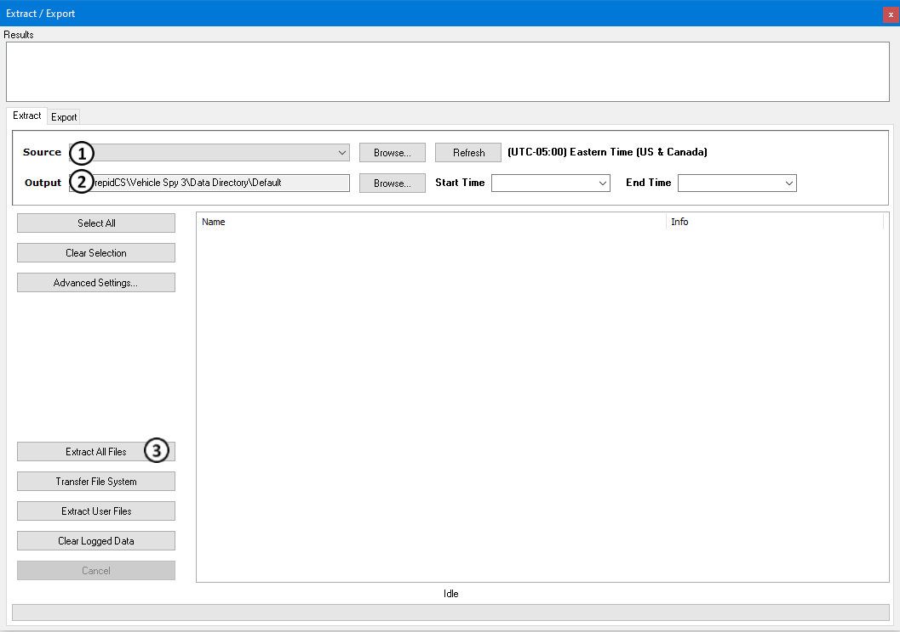

# Part 7 - Extract Data

### Extract Data

The final process is to extract the data that was collected. The data can be extracted directly from the device or the SD card can be removed to allow use of an SD Card Adapter or USB reader. Data is extracted using the extract function in Vehicle Spy 3. Select **Tools> Utilities> Extract / Export** to open this function (Figure 1).

Select the **Source** drive to extract from (Figure 1:). If the drive is not shown, the **Refresh** button can be used to repopulate the list. Now select where to save the data. This is done using the **Browse** button next to the **Output** section in (Figure 1:). The last step is to click the **Extract All Files** button (Figure 1:). This will take the data off of the SD card and put it into the specified directory. When finished, the extract application will launch Windows Explorer at the extracted file path. More information on using Extract/Export can be found here.
