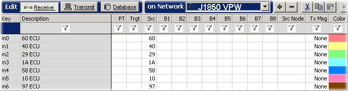

# Part 2 - Enter ECU Source IDs to Sort

### 1. Enter Source IDs in Receive Messages:

First, we need to enter ECU source ID information so the filtering can take place. In  Messages Editor enter a description and source ID for each ECU you wish to record. The ECU source IDs in our example file are: 60, 40, 29, 1A, 58, 10, and 97. Use the ECU ID followed by "ECU" for the description.  Your Messages Editor spreadsheet should look like Figure 1.\
\
\*\*Hint: Notice the Receive table is enabled and J1850 VPW is selected in the Network dropdown.

